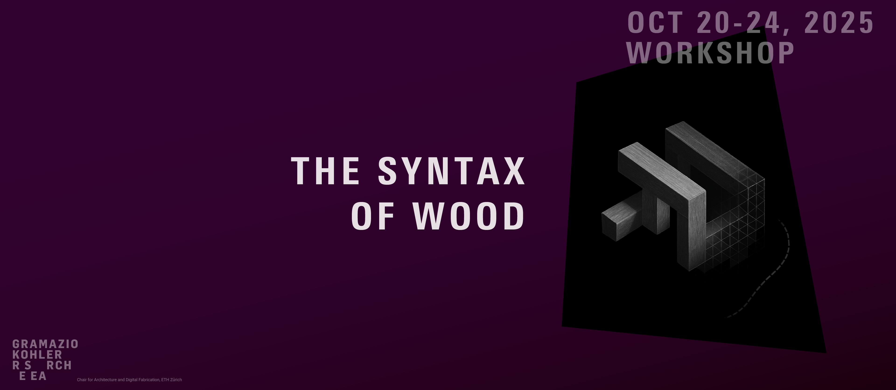

# Workshop: The syntax of wood

> Exploring computational design and digital fabrication with the COMPAS framework and the `compas_timber` package.

## Installation

We will install `compas_timber` in Rhino and also in a standalone Python environment.

### Rhino 8

1. Open Rhino 8, then open the `Package Manager` (type `PackageManager` in the command line), and search for `compas_timber`, install the version `1.0.1`.
2. Restart Rhino.
3. Open the example `00_hello_world.gh` from the `examples` folder to test the installation.

### Standalone

Install `uv` as pre-requisite (if you don't have it yet):

**On Windows:**
```bash
powershell -ExecutionPolicy ByPass -c "irm https://astral.sh/uv/install.ps1 | iex"
```

**On MacOS / Linux:**
```bash
curl -Ls https://astral.sh/uv/install.sh | sh
```

You might need to restart VS Code if it was open during the installation of `uv`.

#### Virtual environment

Open VS Code and open a terminal in the folder of this repository.

Create a new virtual environment:
```bash
uv venv --python 3.14
```

Activate it:

**On Windows:**
```bash
.venv\Scripts\activate
```

**On MacOS / Linux:**
```bash
source .venv/bin/activate
```

Then, install the package via pip:
```bash
uv pip install compas_timber==1.0.1
```

Finally, test the installation by running the `00_hello_world.py` script from the `examples` folder. 

> **Make sure you select the newly created virtual environment in VS Code before running the script.**
> You can do this by clicking on the Python version in the bottom-left corner of VS Code and selecting the interpreter from the `.venv` folder.

## Resources

- [COMPAS Framework](https://compas.dev/)
- [COMPAS docs](https://compas.dev/compas/latest/)
- [COMPAS Timber docs](https://gramaziokohler.github.io/compas_timber/latest/)
